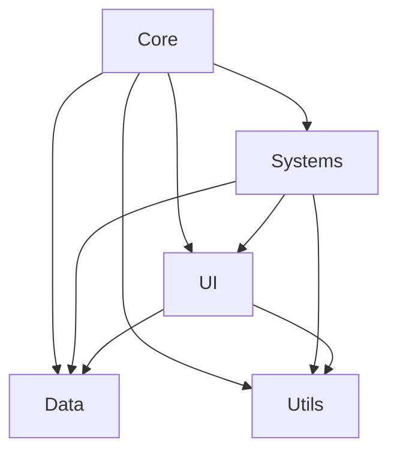

# 🏗️ Dispatcher-Simulator Architektur

## 📁 Neue Ordnerstruktur (v5.0)

```
Dispatcher-Simulator/
├── css/
│   ├── style.css              # Haupt-Stylesheet
│   ├── map-icons.css          # Karten-Icons
│   ├── draggable.css          # Drag & Drop
│   ├── tabs.css               # Tab-Navigation
│   ├── call-system.css        # Notruf-UI
│   └── keywords-dropdown.css  # Stichwort-Dropdown
├── js/
│   ├── core/                  # Kern-Systeme
│   │   ├── game.js           # Haupt-Game Loop
│   │   ├── main.js           # Initialisierung
│   │   ├── config.js         # Zentrale Konfiguration
│   │   └── bridge.js         # System-Integration
│   ├── systems/              # Große Sub-Systeme
│   │   ├── vehicle-movement.js
│   │   ├── call-system.js
│   │   ├── ai-incident-generator.js
│   │   ├── escalation-system.js
│   │   ├── weather-system.js
│   │   ├── mission-timer.js
│   │   └── groq-validator.js
│   ├── ui/                   # UI-Komponenten
│   │   ├── tabs.js
│   │   ├── ui.js
│   │   ├── ui-helpers.js
│   │   ├── assignment-ui.js
│   │   ├── manual-incident.js
│   │   ├── protocol-form.js
│   │   ├── keywords-dropdown.js
│   │   └── draggable.js
│   ├── data/                 # Statische Daten
│   │   ├── data.js          # Haupt-Datenbank
│   │   ├── hospitals.js
│   │   ├── fms-codes.json
│   │   └── incidents.js
│   ├── utils/               # Helfer-Funktionen
│   │   ├── notification-system.js
│   │   ├── scoring-system.js
│   │   ├── incident-numbering.js
│   │   ├── location-generator.js
│   │   ├── address-service.js
│   │   ├── vehicle-analyzer.js
│   │   ├── version-manager.js
│   │   └── tutorial.js
│   └── map.js               # Karten-Logik (Leaflet)
├── data/                    # JSON Daten
├── index.html
└── README.md
```

## 🔄 Migrations-Plan

### Phase 1: ✅ Ordner erstellen
- [x] `js/core/` erstellt
- [x] `js/systems/` erstellt
- [x] `js/ui/` erstellt
- [x] `js/data/` erstellt
- [x] `js/utils/` erstellt
- [x] README.md in jedem Ordner

### Phase 2: 🔄 Dateien verschieben (GEPLANT)
**WICHTIG:** Erst nach Backup/Testing!

```bash
# Core
git mv js/game.js js/core/game.js
git mv js/main.js js/core/main.js
git mv js/config.js js/core/config.js
git mv js/bridge.js js/core/bridge.js

# Systems
git mv js/vehicle-movement.js js/systems/vehicle-movement.js
git mv js/call-system.js js/systems/call-system.js
git mv js/ai-incident-generator.js js/systems/ai-incident-generator.js
git mv js/escalation-system.js js/systems/escalation-system.js
git mv js/weather-system.js js/systems/weather-system.js
git mv js/mission-timer.js js/systems/mission-timer.js
git mv js/groq-validator.js js/systems/groq-validator.js

# UI
git mv js/tabs.js js/ui/tabs.js
git mv js/ui.js js/ui/ui.js
git mv js/ui-helpers.js js/ui/ui-helpers.js
git mv js/assignment-ui.js js/ui/assignment-ui.js
git mv js/manual-incident.js js/ui/manual-incident.js
git mv js/protocol-form.js js/ui/protocol-form.js
git mv js/keywords-dropdown.js js/ui/keywords-dropdown.js
git mv js/draggable.js js/ui/draggable.js

# Data
git mv js/data.js js/data/data.js
git mv js/hospitals.js js/data/hospitals.js
git mv js/fms-codes.json js/data/fms-codes.json
git mv js/incidents.js js/data/incidents.js

# Utils
git mv js/notification-system.js js/utils/notification-system.js
git mv js/scoring-system.js js/utils/scoring-system.js
git mv js/incident-numbering.js js/utils/incident-numbering.js
git mv js/location-generator.js js/utils/location-generator.js
git mv js/address-service.js js/utils/address-service.js
git mv js/vehicle-analyzer.js js/utils/vehicle-analyzer.js
git mv js/version-manager.js js/utils/version-manager.js
git mv js/tutorial.js js/utils/tutorial.js
```

### Phase 3: index.html aktualisieren
Alle `<script src="js/...` zu neuen Pfaden ändern

### Phase 4: Build-System (Optional)
Vite oder Webpack für Bundling

## 🎯 Vorteile der neuen Struktur

1. **Übersichtlichkeit**: Klare Trennung nach Verantwortlichkeit
2. **Wartbarkeit**: Einfacher zu finden welche Datei was macht
3. **Skalierbarkeit**: Neue Features können strukturiert hinzugefügt werden
4. **Team-Arbeit**: Mehrere Entwickler können parallel arbeiten
5. **Testing**: Tests können pro Modul organisiert werden

## 📊 Modul-Abhängigkeiten



## 🔧 Aktuelle Status

- ✅ Fix #1: Vehicle visibility (map.js)
- ✅ Fix #2: Smooth position interpolation (vehicle-movement.js v6.2)
- ✅ Fix #3: Routing timeout (vehicle-movement.js v6.2)
- 🔄 Fix #4: Folder structure (Phase 1 komplett)

## 📝 Nächste Schritte

1. **Vor Migration testen:**
   - Alle Funktionen testen
   - Backup erstellen
   
2. **Migration durchführen:**
   - Dateien verschieben (Phase 2)
   - index.html aktualisieren (Phase 3)
   
3. **Nach Migration:**
   - Alle Funktionen erneut testen
   - Cache löschen (Strg+Shift+R)
   - Dokumentation aktualisieren

## 🚀 Performance-Optimierungen (Geplant)

1. **Bundle System** (Webpack/Vite)
   - Von 33 auf 5-6 Bundles reduzieren
   - Minification
   - Tree-shaking
   
2. **Lazy Loading**
   - Systeme nur laden wenn gebraucht
   - Tutorial nur bei Bedarf
   
3. **Service Worker**
   - Offline-Fähigkeit
   - Caching
   
4. **Code-Splitting**
   - Core: ~50KB
   - Systems: ~80KB
   - UI: ~60KB
   - Data: ~20KB
   - Utils: ~30KB